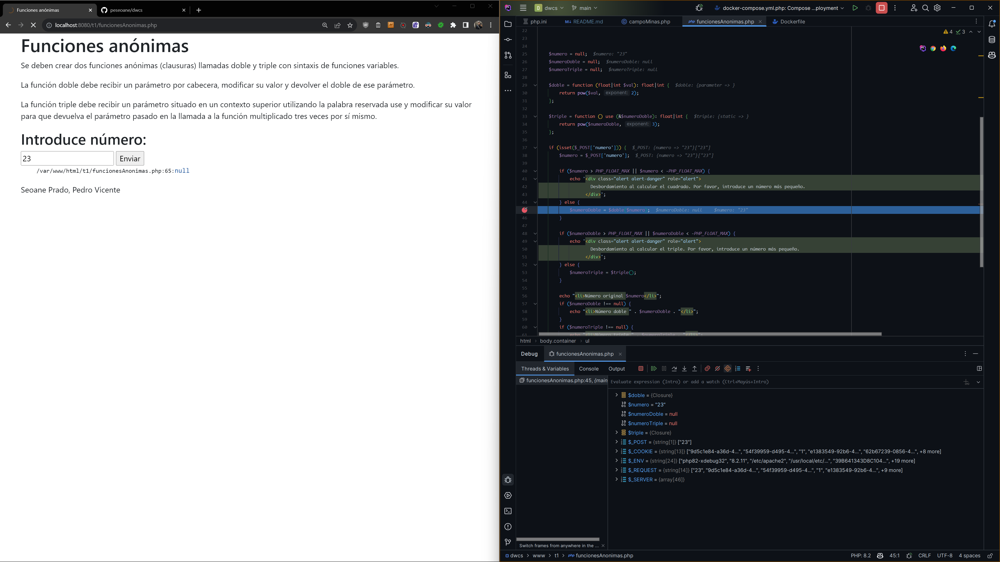
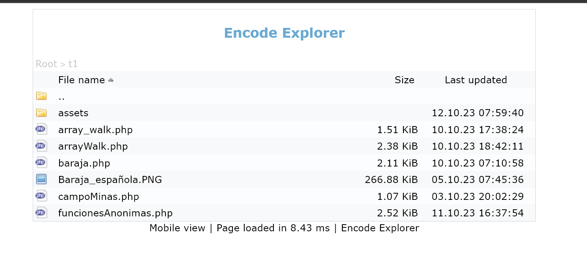

# Instrucciones

## Dockerfile

En teoría son agnósticos de plataforma en versiones modernos, si no habrá que cambiar en el Dockerfile para arquitecturas Apple Sillicon en el fichero `Dockerfile`:

```dockerfile
FROM php:8.2-apache AS build-php
RUN --mount=type=cache,target=/var/cache/apt apt update && apt full-upgrade -qy && apt clean -qy && apt autoremove -qy
RUN mount=type=cache,target='/usr/local/lib/php' \
    pecl install xdebug \
    && docker-php-ext-enable xdebug
```

Debería automáticamente escoger o bien `amd64` o `arm64`, para ello hay que tener el sistema `buildx` activado, que cualquier Docker actualizado ya lo tiene incorporado.

La versión usada es: [php:8.2-apache](https://hub.docker.com/layers/library/php/8.2-apache/images/sha256-ea110a6b764ad7fcfef9ca644afd3af3968f54a1fb4a5de54e4a2750200355bf?context=explore)

El resto del fichero, al estar basada la imagen en Debian nos actualiza usando una cache las dependencias, instala xdebug y lo habilita.

> Al usarse una caché, no podrás construir al mismo tiempo dos imágenes exactamente al mismo tiempo por el lock de apt, es complicado que se te de el caso no obstante…

## Docker-compose

La única peculiaridad es que para sistemas UNIX like es necesario que se resuelva el `"host.docker.internal:host-gateway` para que sepa xdebug a donde mandar sus peticiones.

> Este fichero monta de la carpeta local config el `php.ini`, cualquier cambio en el fichero, habrá que reconstruir el contenedor (es más rápido a entrar y reiniciar el servicio no es que docker no actualice en el target el fichero si no que systemd requiere que reiniciemos el servicio y no estamos para eso habiendo opciones más rápidas)
>
> `docker-compose up --force-recreate --build -d`
>
> Al tirarlo con -d (detach), pulsando hacia arriba e intro nos lo volverá a reconstruir mucho más rápido, salvo que necesites ver el log.
>
> Y eso ya nos tiene en cuenta borrar el viejo y adaptar el nuevo.
>
> Los ficheros es un bindmount que al no dependender de un servicio, los cambios van en tiempo real.

```yaml
version: "3"
services:
  php:
    container_name: dwcs-php
    build:
      context: .
      dockerfile: Dockerfile
    hostname: php82-xdebug32
    volumes:
      - ./config/error_reporting.ini:/usr/local/etc/php/conf.d/error_reporting.ini
      - ./config/php.ini:/usr/local/etc/php/php.ini
      - "./www/:/var/www/html"
    ports:
      - "8080:80"
    working_dir: /var/www/html
    environment:
      XDEBUG_CONFIG: remote_host=host.docker.internal remote_port=9003 remote_enable=1
    networks:
      - dwcs
    extra_hosts:
      - "host.docker.internal:host-gateway"

networks:
  dwcs:
    driver: bridge
volumes:
  dwcs-db:
```

## Configuración en PHP Storm

Lo primero, es indicarle que nuestro intérprete se ejecuta desde docker-compose, es preferible decirle que no nos cree contenedores nuevos si no que se enganche al mismo siempre.


Luego, hay que decirle que ese intérprete, es nuestro servidor, que en nuestro caso es `localhost:8080`, variando en el `Docker-compose` el puerto, aquí debe ajustarse igualmente.

> MUY IMPORTANTE
>
> Como se montó la carpeta `www` en el `docker-compose` como `/var/www/html` hay que decirle a PHPStorm que tenga en cuenta los paths locales que son diferentes a los globales, si no, cargará erróneamente las páginas desde /.


Por último hay que decirle que espere conexiones del depurador por el puerto que dijimos, el 9003.


## Como se usa

Abres localhost:8080 y navegas a la página deseada.

Si pones un breakpoint o lo que sea en el fichero de destino, saltará.



## Navegador

En `index.php`, es decir localhost:8080/ hay un pequeño script que nos sirve para navegar por el fs.


